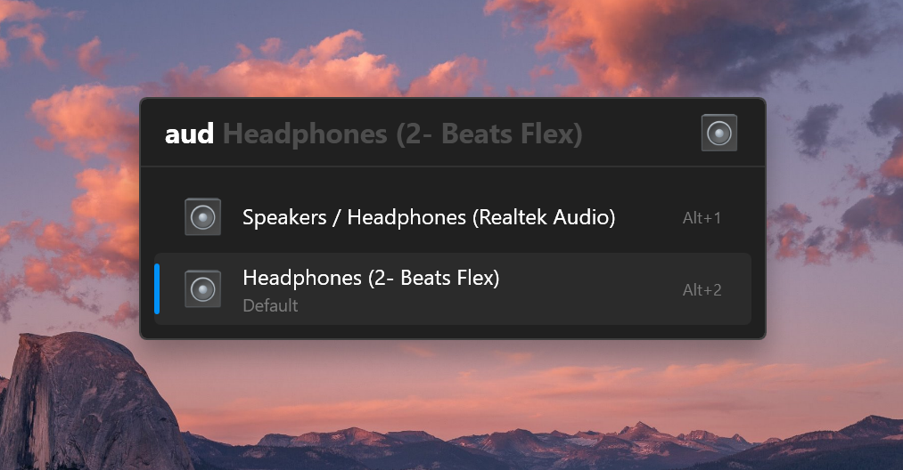

A [Flow Launcher](https://github.com/Flow-Launcher/Flow.Launcher) plugin to to list and switch between audio devices.

> [!WARNING]
> This is very early version of the plugin, it may not work as expected. 

## Prerequisites

you have to install this powershell module to be able to use the plugin: https://github.com/frgnca/AudioDeviceCmdlets 

```
Install-Module -Name AudioDeviceCmdlets
```

## Installation

currently, the plugin is not available in the Flow Launcher plugin store. you can install it manually by running the following command in Flow Launcher:

```
pm install https://github.com/adielBm/Flow.Launcher.Plugin.AudioDevices/releases/latest/download/Flow.Launcher.Plugin.AudioDevices.zip
```

## Usage

the default keyword is `aud`, you can change it in the plugin settings.


